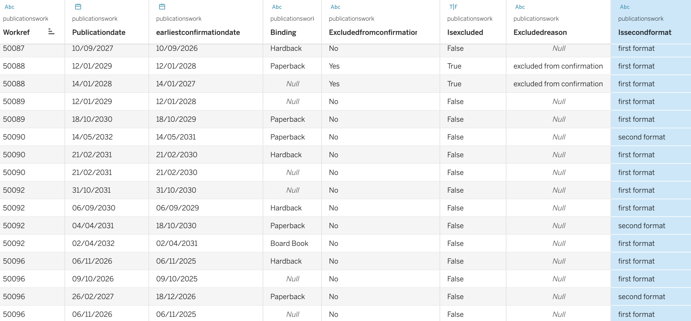
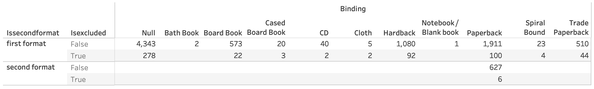

# task-mcm

# Book Metadata Confirmation Check 
## Project Overview 
This project automates checks on book records (Editions) to ensure they are ready to be confirmed and fed out to retailers and data aggregators 12 months prior to publication. As part of the confirmation process, various metadata checks are conducted to ensure the completeness and compliance of Edition records with industry best practices. The confirmation process also needs to account for different book formats and publication timelines, particularly ensuring that "Second Format" paperbacks do not undermine the sales of higher-priced "First Format" editions. This script takes a dataset of Editions (identified by ISBNs) and carries out the following checks to determine if they should be confirmed or held back from the feed. 

## Features 
### 1. **Edition Exclusion Check** 
Identifies Editions that should be excluded from confirmation. This includes: 
- Editions marked as embargoed. 
- Editions flagged as confidential.
- Editions currently under embargo
- Any additional exclusion indicators present in the dataset. 
### 2. **Work Status Check** 
Flags Editions that are not yet ready for confirmation due to their **Work Status**. Specifically: 
- Editions with a Work Status of **Pre-Acquisition** are identified, as they lack the necessary contracts and cannot be fed out. 
### 3. **Metadata Completeness Check** 
Ensures Editions have the necessary metadata for confirmation. Missing data in any of the following fields will be flagged: 
- **Extent** (number of pages, etc.) 
- **Format** (e.g., Hardback, Paperback, Ebook, etc.) 
- **Price Sync Template** (for ebooks only) 
### 4. **Second Format Identification** 
Identifies paperback Editions that are **Second Formats**, i.e., those that publish after the "First Format" (Hardback, Trade Paperback, etc.). The script checks: 
- Whether the Edition is a Second Format. 
- Ensures that its feed date is **6 weeks after** the First Format’s publication date to prevent undermining First Format sales. 
### 5. **Feed Date Calculation for Second Formats** 
- For identified Second Format Editions, the script calculates the appropriate feed-out date based on the rule: "6 weeks after the First Format edition publication date."
    
## Input 
The input to the script is a dataset that contains book Editions and relevant metadata. Each Edition is represented by: 
- **ISBN** (International Standard Book Number) 
- **Work Ref** (Biblio-assigned Work Reference number for Editions of the same book) 
- Metadata fields including **Extent**, **Format**, **Price Sync Template**, **Work Status**, and flags for exclusion, embargo, or confidentiality. 
## Output 
The script generates a report highlighting the Editions that: 
- Should not be confirmed due to exclusion flags or missing metadata. 
- Have a Work Status that prevents confirmation. 
- Are Second Format Editions and require feed date adjustments. This report can be reviewed by the line manager for further action before final confirmation decisions are made.

## Results
The results of the cleansing and analysis can be found [here](./publishing_data_results.csv)

633 second formats were identified and their earliest confirmation dates were confirmed to be at least 6 weeks after the publication of the first edition.

In these results you can see that each edition has a publication date and an earliest confirmation date. For most entries the confirmation date is a year prior to the publication date.

Under workref 50092 the paperback's earliest confirmation date is less than a year before its publication because it is a second format, and so can only be confirmed 6 weeks after the hardback is published.

Under workref 50088 the editions have a confirmation date, however it is currently maked as excluded from confirmation. The earliest confirmation date describes the earliest it could be confirmed, however this is only if the exclusion status changes before this time.

**Note** Binding was used to determine whether an edition is first of second format, however there are a large number of editions where the binding is NULL. Inspection of the data revealed these to primarily be ebooks and so were assumed not to be second formats. There were 25 where the binding was listed as NULL and the vistaformat is Paperback. These are treated as first editions but should be reviewed to ensure that their binding is correct
  
## How to Use 
1. **Prepare the Dataset:** 
- Ensure the [dataset](./panmacmillan_data.csv) containing book Edition information is correctly formatted, including ISBNs, Work Refs, and all relevant metadata fields. Note that data should be loaded with nulls for empty fields.
2. **Run the Script:** 
- Execute the [sql in the script](./macmillan_script.sql) to perform the checks listed above. 
3. **Review the Output:** 
  Data has been analysed so that if isExcluded is False then the edition can be confirmed at the earliestConfirmationDate
- **Columns created by the script**
    - isExcluded
        - TRUE if the edition has been excluded from confirmation, embargoed for a later date, marked as confidential or given the status pre-Aquisition
        - NOTE - some embargo dates were listed in the
    - metadataIssues
        - True if there is missing data including
              a)	Extent
              b)	Format
              c)	Price Sync Template (for ebooks only)
          - Based on current assumptions editions have not been excluded from confirmation due to this data being missing but this can be updated if necessary.
    - isSecondFormat
        - True if a paperback has been identified as being a second format, based on the existence of a first edition with the same work reference
    - earliestConfirmationDate
        - The earliest date an edition can be confirmed assuming that it has not been excluded (see isExcluded)
        - For most editions this is a year prior to its publication dates
        - For second edition paperbacks this is either a year prior to its publication date or 6 weeks after the earliest first edition is published, whichever is later.

## Data Quality Issues
- determining first and second editions
    - the data quality in the column 'binding' appeared to be the best for identifying first editions, and therefore where paperbacks should be classified as second editions
    - there are a number of nulls in the 'binding' column, however upon reviewing the data these are not related to physical books and so I felt comfortable excluding them in the identification of second editions as the primary concern was the affect of an early paperback release on sales of the hardbacks and trade paperbacks.
 - There are 25 of records where vistaformat is 'Paperback' but binding is not 'Paperback'. This should be reviewed and updated if in error
